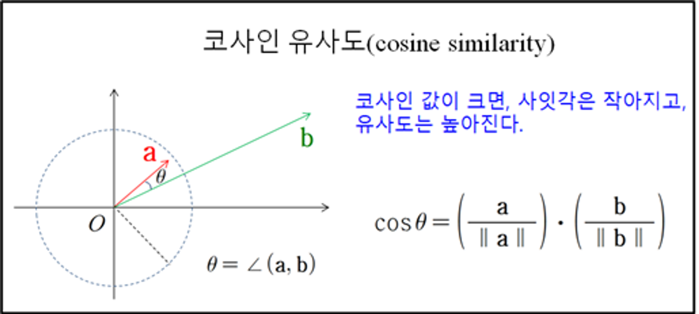
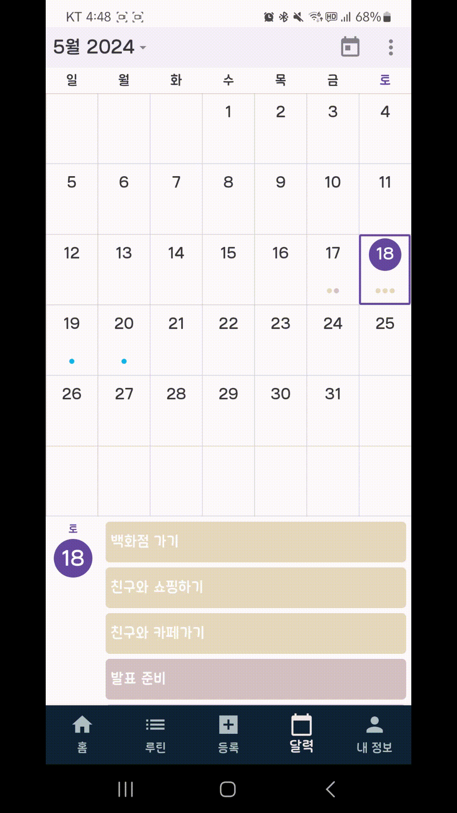
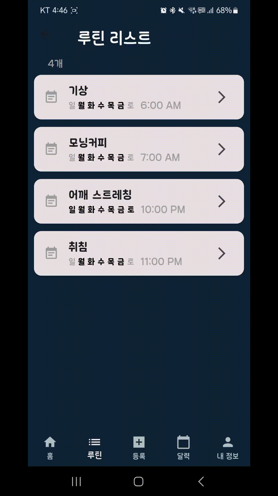
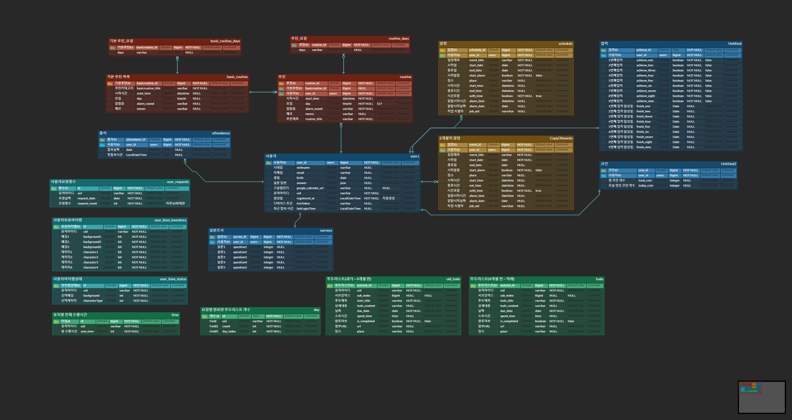
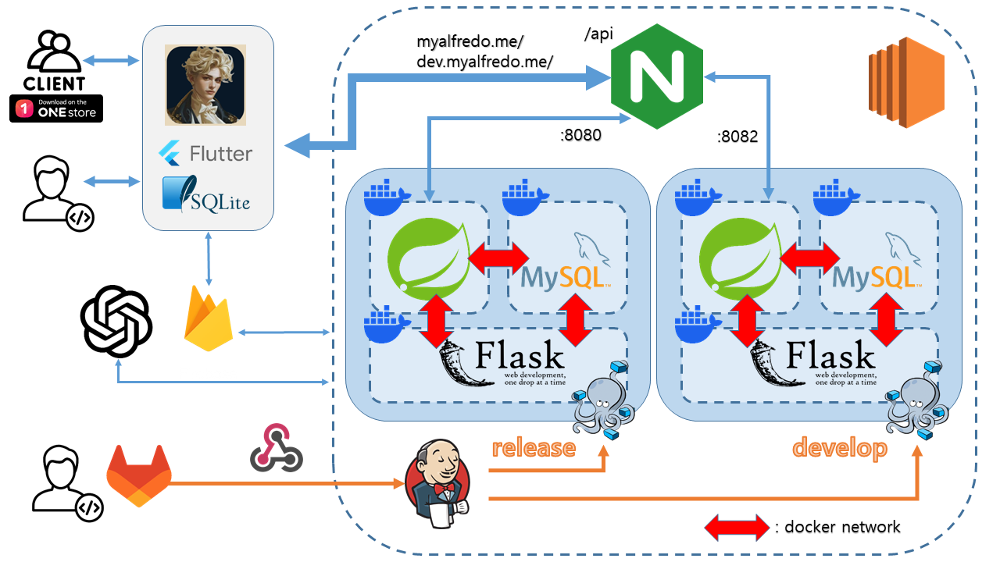

# 알프레도

 

## 👪 개발 멤버 소개

<table> 
  <tr> 
    <td height="140px" width="16.6%" align="center"> 
      <a href="https://github.com/dolpongg"> 
           👑 조성주  (Full-Stack) 
      </a> 
       
    </td> 
    <td height="140px" width="16.6%" align="center"> 
      <a href="https://github.com/xswaqz">  
           😆 권근열  (Full-Stack) 
      </a> 
       
    </td> 
    <td height="140px" width="16.6%" align="center"> 
      <a href="https://github.com/mickeyshoes"> 
           😶 권수지  (Full-Stack) 
      </a> 
       
    </td> 
    <td height="140px" width="16.6%" align="center"> 
      <a href="https://github.com/YongjaeKwon">
           🙄 김태완  (Full-Stack) 
      </a> 
       
    </td> 
    <td height="140px" width="16.6%" align="center"> 
      <a href="https://github.com/moxnox63">  
           😁 송의찬  (Full-Stack) 
      </a> 
       
    </td> 
    <td height="140px" width="16.6%" align="center"> 
      <a href="https://github.com/HanKyeon"> 
           🙂 최홍준  (Full-Stack) 
      </a> 
       
    </td> 
  </tr>
  <tr> 
    <td align="center">
      할 일 컴포넌트 FE/BE구현 
      요일별 할 일 완료 개수 API구현 
      유저별 전체 수행시간 API 구현 
      데이터 분할 관리 구현 
      업적 페이지 FE 구현
    </td>
    <td align="center">
      소셜 로그인 구현 
      루틴 추천 알고리즘 구현 
      ONE Store 앱 배포 
      마이페이지 FE/BE 구현 
      발표
    </td> 
    <td align="center">
      루틴 페이지 FE/BE 
      루틴 알림 구현 
      할 일 완료 유무 알림 구현 
      출석체크 구현 
      문서 작성
    </td>
    <td align="center">
      캘린더 페이지 FE, ical 
      메인페이지 FE 
      상점 페이지 FE 
      발표자료 준비
    </td>
    <td align="center">
      일정 등록 BE 구현 
      일정 알림 구현 
      데이터 분할 관리 구현 
      업적 관련 BE 구현 
      업적 달성 알림 구현 
      UCC
    </td>
    <td align="center">
      CI/CD 
      전체 일정 tts 구현 
      상점 API 구현 
      인프라
    </td>
  </tr>
</table>

 

## 📆 프로젝트 기간 

### 24.04.08 ~ 24.05.20

- 기획 및 설계 : 24.04.08 ~ 24.04.16
- 프로젝트 구현 : 24.04.17 ~ 24.05.14
- 버그 수정 및 산출물 정리 : 24.05.15 ~ 24.05.18

 

## 🛠️ 기술 스택

#### Front

 

#### Back

       

#### DB

 

#### Cloud

#### CI/CD

  

#### 기타

#### 협업 툴

  

 <b> 상세 기술스택 및 버전</b> 

| 구분     | 기술스택           | 상세내용              | 버전   |
| -------- | ------------------ | --------------------- | ------ |
| 공통     | Gitlab             | 형상관리              | \-     |
|          | Jira               | 이슈관리              | \-     |
|          | Mattermost, Notion | 커뮤니케이션          | \-     |
| FrontEnd | Flutter            | 프론트 프레임워크     | 3.19.5 |
|          | axios              | API 통신 라이브러리   | 1.6.7  |
|          | IDE                | Visual Studio Code    | \-     |
| BackEnd  | Java               | OpenJDK               | 17     |
|          | Spring Boot        | Java Server Framework | 3.2.5  |
|          | JPA                |                       | 3.2.4  |
|          | IntelliJ           | IDE                   | \-     |
|          | Flask              |                       | \-     |
|          | OAuth2             |                       | \-     |
|          | Gradle             | Build                 | 8.5    |
| DB       | MySQL              | DBMS                  | 8.0.36 |
|          | SQLLITE            |                       |        |
| Cloud    | Firebase           |                       |        |      
| Server   | AWS EC2            | Server                | \-     |
|          | Nginx              |                       | 1.24.0 |
|          | Docker             |                       | 25.0.4 |
|          | Jenkins            |                       | 2.448  |

 

## 실제 서비스 화면

### 시작페이지(루틴 추천, 출석체크)

<table>
  <tr>
    <td>
      
    </td>
    <td>
      

        
루틴 추천(flask,cosine유사도)

        
        <ul>
          <li>유저의 설문조사 답변을 기반으로 가장 유사한 유저들을 찾아, 그들이 사용하는 기본 루틴을 추천합니다.</li>
          <li>파이썬의 다양한 라이브러리들을 활용하기 위해 따로 flask서버를 구축하고 메인서버인 spring boot 서버와 통신합니다.</li>
        </ul>
      

      

        
출석체크(푸시알림)

        <ul>
          <li>사용자가 메인화면에 진입할 때, 출석 체크 및 최근 로그인 시간을 업데이트합니다.</li>
          <li>사용자가 하루 중 맨 처음으로 메인화면에 진입할 때만, 유저의 해당 주 출석 캘린더를 제공하는 모달을 띄워줍니다.</li>
          <li>SharedPreferences를 활용해서 유저 디바이스에 현재 날짜를 저장합니다.</li>
        </ul>
      

    </td>
  </tr>
</table>

### 할 일 등록

<table>
  <tr>
    <td>
      
    </td>
    <td>
      

        
todo-timer, 반복 등록*수정*삭제, db조회속도 증가를 위한 4개월 테이블 분리

        <ul>
          <li><strong>timer</strong>
            <ul>
              <li>할 일 별 타이머를 만들어 수행시간을 측정할 수 있는 기능을 만들었습니다.</li>
              <li>할 일 시간을 모두 더하여 5분 이상을 넘을 경우, 업적을 달성할 수 있도록 하였습니다.</li>
            </ul>
          </li>
          <li><strong>반복 등록, 수정, 삭제</strong>
            <ul>
              <li>UUID를 사용한 subIndex를 활용하여 할 일을 반복해서 등록, 수정하고 삭제할 수 있는 기능을 만들었습니다.</li>
              <li>처음 반복 등록할 때 사용자가 시작, 종료 날짜와 요일을 설정하면 해당하는 날짜 모두에 todolist가 등록될 수 있도록 했습니다.</li>
              <li>반복 할 일 등록을 할 때만 subIndex를 생성하도록 설정하였고, subIndex를 통해 수정과 삭제가 한꺼번에 가능하도록 설정했습니다.</li>
            </ul>
          </li>
          <li><strong>4개월 테이블 분리</strong>
            <ul>
              <li>db조회속도 증가를 위해서 todo테이블과 oldtodo테이블 두 개의 todolist 관련 테이블을 만들었습니다.</li>
              <li>새롭게 등록하는 todo는 우선적으로 todo테이블에 저장하도록 했습니다.</li>
              <li>Scheduling을 활용하여, 매월 1일 오전 5시에 4개월 전의 데이터를 Oldtodo라는 테이블로 이동하도록 함과 동시에 todo에서 4개월 전 데이터는 삭제하도록 구성했습니다.</li>
              <li>일정 또한 같은 형식으로 관리하여, 일정 조회 속도도 증가시킬 수 있었습니다.</li>
            </ul>
          </li>
        </ul>
      

    </td>
  </tr>
</table>

### 할 일 완료, 음성서비스

<table style="width: 100%; table-layout: fixed;">
  <tr>
    <td style="width: 320px; vertical-align: top;">
      
    </td>
    <td style="vertical-align: top;">
      

        
음성서비스 tts(todo, 일정) open ai tts

        <ul>
          <li>첫 번째로, 서버는 인증된 사용자의 당일 할 일과 일정 데이터를 문자열(String) 형태로 가공합니다.</li>
          <li>두 번째로, 서버는 OpenAI의 TTS API를 호출하여 오디오 스트림 데이터를 받아옵니다.</li>
          <li>세 번째로, 서버는 OpenAI로부터 받은 오디오 스트림 데이터를 수집하여 하나의 바이트 배열(byte array)로 변환합니다.</li>
          <li>네 번째로, 변환된 오디오 데이터를 클라이언트에 스트리밍 방식으로 전달합니다.</li>
          <li>마지막으로, 클라이언트는 수신한 오디오 데이터를 파일로 저장한 후 재생하여 데이터의 정확성을 보장합니다.</li>
          <li>이러한 과정을 통해, 저희 앱은 사용자에게 정확한 TTS 기능을 제공하며, 사용자의 편의성을 높입니다.</li>
        </ul>
      

    </td>
  </tr>
</table>

### 일정 알람

<table style="width: 100%; table-layout: fixed;">
  <tr>
    <td style="width: 320px; vertical-align: top;">
      
    </td>
    <td style="vertical-align: top;">
      

        
일정(푸시알림)-fcm

        <ul>
          <li><strong>일정</strong>
            <ul>
              <li>사용자는 일정의 시작 종료 날짜를 선택하고, 하루 종일 선택하지 않은 경우 일정의 시작시간, 종료시간을 입력할 수 있습니다.</li>
              <li>알림 사용 선택한 경우 일정 시작전 혹은 커스텀을 통해 원하는 시간에 알림을 받을 수 있습니다.</li>
            </ul>
          </li>
          <li><strong>FCM</strong>
            <ul>
              <li>Quartz를 사용해 구현했습니다.</li>
              <ul>
                <li>Quartz - java 기반 작업 스케쥴링 라이브러리</li>
              </ul>
              <li>구동 순서</li>
              <ul>
                <li>Job으로 보낼 메세지를 정의합니다.</li>
                <li>SimpleTrigger로 알림시간을 설정합니다.</li>
                <li>Scheduler로 Job과 trigger를 연결후 실행합니다.</li>
              </ul>
            </ul>
          </li>
        </ul>
      

    </td>
  </tr>
</table>

### 일정

### 루틴
<table style="width: 100%; table-layout: fixed;">
  <tr>
    <td style="width: 320px; vertical-align: top;">
      
    </td>
    <td style="vertical-align: top;">
      

        
루틴(푸시알림)-fcm, 기본루틴

        <ul>
          <li>루틴 제목, 시간, 요일, 메모 설정으로 루틴을 생성할 수 있습니다.</li>
          <li>루틴 리스트로 설정된 루틴 확인 및 수정, 삭제 기능이 있습니다.</li>
          <li>기본루틴 뱃지 선택을 통해, 시간, 요일 등의 기본설정으로 루틴 생성에 도움을 줍니다. (추후 루틴 추천에 활용)</li>
          <li>FCM으로 설정된 루틴 시간에 푸시알람을 보내줍니다. (포그라운드, 백그라운드알람)
            <ul>
              <li>유저 로그인 시, FCM 토큰(기기 토큰)을 유저 정보에 저장합니다.</li>
              <li>@scheduled, cron표현식으로 매 분 마다, 현재시간과 루틴 시간을 비교하여 같은 경우 FCM에 알림을 요청합니다. (FCM 토큰과 routine 제목을 넘겨 줍니다.)</li>
            </ul>
          </li>
        </ul>
      

    </td>
  </tr>
</table>

### 캘린더
<table style="width: 100%; table-layout: fixed;">
  <tr>
    <td style="width: 320px; vertical-align: top;">
      
    </td>
    <td style="vertical-align: top;">
      

        
캘린더_ical(kakao,google 캘린더)

        

          위 부분에 날짜 클릭시 달 별로 선택 가능한 기능 있고, 달 뒤에 년을 클릭하면 년도 선택이 가능합니다. 
          날짜 옆에 달력 모형 클릭하면 오늘 날짜 페이지로 이동 가능합니다. 
          햄버거 클릭시 보고 싶은 캘린더 모형 선택이 가능합니다.
        

        <ul>
          <li><strong>iCal 데이터는 파란색,</strong></li>
          <li><strong>할 일은 갈색,</strong></li>
          <li><strong>일정은 베이지색 입니다.</strong></li>
          <li>각 컴포넌트 터치(클릭)시 수정, 삭제 모달 띄워 주는 기능이 있습니다.</li>
        </ul>
        
<strong>캘린더 모형별 기능</strong>

        <ul>
          <li><strong>모형 Day:</strong> 할 일, 하루 종일on한 일정은 위에 표시됨 (3개 이상 넘어가면 아코디언 형식으로 띄웁니다.), 시간대를 설정한 일정은 그 시간대에 맞게 컴포넌트가 생성됩니다.</li>
          <li><strong>모형 Week:</strong> 할 일, 하루 종일on한 일정은 위에 표시됩니다. (2개 이상이면 아코디언 형식으로 띄웁니다.), 시간대를 설정한 일정은 그 시간대에 맞게 컴포넌트가 생성됩니다.</li>
          <li><strong>모형 Month:</strong> 각 날짜 누르거나 위로 올리면 컴포넌트를 볼 수 있는 공간이 나옵니다., 위로 한번 더 올리면 위 공간이 선택한 날 기준 1주로 바뀌며 컴포넌트를 보는 공간이 늘어남</li>
          <li><strong>모형 Schedule:</strong> 무한 스크롤로 데이터를 계속 볼 수 있습니다.</li>
        </ul>
      

    </td>
  </tr>
</table>

### 업적
<table style="width: 100%; table-layout: fixed;">
  <tr>
    <td style="width: 320px; vertical-align: top;">
      
    </td>
    <td style="vertical-align: top;">
      

        
업적, 상점(재미요소)

        <ul>
          <li><strong>업적</strong>
            <ul>
              <li>사용자가 특정 조건을 만족하면 업적 자동으로 달성합니다.</li>
              <ul>
                <li>총 일정의 갯수, 총 출석일수, 로그인한 날이 생일인 경우 등등</li>
              </ul>
              <li>업적 달성시 푸쉬알림과 함께 50개의 코인 얻을 수 있습니다.</li>
            </ul>
          </li>
          <li><strong>코인</strong>
            <ul>
              <li>업적 1개 달성시 50개 획득</li>
              <li>할 일을 체크하면 5개씩 하루에 최대 50개 얻을 수 있습니다.</li>
            </ul>
          </li>
        </ul>
      

    </td>
  </tr>
</table>

### 상점

### 마이페이지

마이페이지(ical링크 등록, 할 일 개수 차트)

- 유저 정보 수정에서 ical 링크를 등록 할 수 있습니다.
- 완료한 할 일 개수를 차트에서 1주일 단위로 보여줍니다.

 

## ERD

## 시스템 아키텍처

시스템 아키텍쳐

1. **GitLab Webhook을 통한 Jenkins CI/CD**:
    - GitLab의 Webhook을 사용하여 Jenkins에서 CI/CD 파이프라인을 트리거합니다. 이를 통해 코드가 커밋되면 자동으로 빌드 및 배포가 이루어집니다.
2. **개발 서버와 배포 서버의 트래픽 분리**:
    - NGINX 리버스 프록시를 사용하여 개발 서버(dev.myalfredo.me)와 배포 서버(myalfredo.me)의 트래픽을 분리합니다.
    - 배포 서버는 포트 8080에서, 개발 서버는 포트 8082에서 각각 Spring 애플리케이션으로의 요청을 처리합니다.
3. **Docker 네트워크 구성을 통한 외부 통신 차단**:
    - Docker 네트워크를 사용하여 각 서비스 간의 내부 통신을 관리하고, 외부 네트워크로의 접근을 제한합니다.
    - 배포와 개발 환경 모두에서 독립적인 네트워크를 사용하여 격리된 환경을 제공합니다.

## 협업 관리

### Git Flow
git flow 사용을 위해 우아한 형제들의 git flow 사용을 참고했습니다. 각자 맡은 기능에 맞게 feature 브랜치를 생성하고, 완료된 기능은 develop에 merge하여 사용했습니다. 충돌 상황을 최소화하고자 매일 오전 스크럼에 develop 최신 버전을 pull받고 시작할 것을 강조했습니다. 
**브랜치 작성 방법** : `FE/feature/기능이름 or BE/feature/기능이름` 
**예시** : FE/feature/user

브랜치는 master, develop, feature 총 3가지를 사용했으며 전략은 다음과 같습니다.

- **master** : 서비스가 출시될 수 있는 브랜치입니다. master 브랜치에 올라온 기능들은 에러 없이 작동하는 상태입니다.

- **develop** : 다음 서비스 출시를 위해 실제 개발이 이루어지는 브랜치입니다.

- **feature** : 기능 단위 개발을 위한 브랜치로 develop에서 분기하여 개발이 끝나면 각각 베이스 브랜치로 병합됩니다.

  
커밋 타입

  <table>
    <tr>
      <th>타입</th>
      <th>설명</th>
    </tr>
    <tr>
      <td>Feat</td>
      <td>새로운 기능 추가</td>
    </tr>
    <tr>
      <td>Fix</td>
      <td>버그 수정</td>
    </tr>
    <tr>
      <td>Refactor</td>
      <td>코드 리팩토링</td>
    </tr>
    <tr>
      <td>Test</td>
      <td>테스트 코드 추가, 테스트 코드 리팩토링</td>
    </tr>
    <tr>
      <td>Rename</td>
      <td>파일명(or 폴더명) 수정</td>
    </tr>
    <tr>
      <td>Move</td>
      <td>파일 또는 폴더 경로 변경</td>
    </tr>
    <tr>
      <td>Remove</td>
      <td>코드 또는 파일 삭제</td>
    </tr>
    <tr>
      <td>Depend</td>
      <td>의존성 추가, 삭제</td>
    </tr>
    <tr>
      <td>Conf</td>
      <td>설정 파일 변경</td>
    </tr>
    <tr>
      <td>Comment</td>
      <td>주석 수정</td>
    </tr>
    <tr>
      <td>Docs</td>
      <td>문서 수정 (ex README.md)</td>
    </tr>
    <tr>
      <td>Design</td>
      <td>CSS 수정</td>
    </tr>
    <tr>
      <td>Chore</td>
      <td>기타 작업</td>
    </tr>
    <tr>
      <td>Init</td>
      <td>초기 생성</td>
    </tr>
  </table>

### 📋 Jira

매주 월요일 오전 데일리 스크럼에서 차주에 진행되어야 할 이슈를 백로그에 등록했습니다. 금주에 완료하지 못한 이슈나, 앞으로 진행할 이슈들을 추가했습니다.

데일리 스크럼, 유튜브 라이브와 같이 공통적인 일정부터 파트별 회의, 개인 개발 작업까지 회의를 통해 구체적으로 계획했습니다.

- 에픽은 가장 큰 단위 기준으로 구성하였습니다.

이를 위해 사용된 요소들은 다음과 같습니다.

**에픽** : 작업이 속하는 최상위 레벨로 회의, FE, BE, 인프라, 문서, 기타 총 6가지 에픽을 만들었습니다.

**스토리** : 에픽에 속하는 작업의 단위입니다. 구체적인 작업 내용을 작성하고 스토리 포인트로 예상 소요 시간을 산정할 수 있습니다. 한 스토리 당 최대 4시간을 넘지 않게 하였고 개인별로 매주 40시간 이상 할당했습니다.

**번다운 차트** : 스프린트의 진행 상황을 추적하고, 남은 작업량과 완료된 작업량을 시각적으로 보여주는 지표입니다.

 

### 📝Notion

모두가 공유해야할 자료 및 링크는 노션에 정리했습니다. 특히 `Convention`과 `API 명세서`, `ERD` 와 같은 주요 정보들은 노션에 공유하여 불필요한 커뮤니케이션 리소스를 줄이기 위해 노력했습니다.

프로젝트 컨벤션, 문서, 참고자료, 산출물, 데일리 스크럼 등을 설정했습니다.

 

## 프로젝트 산출물
[기능명세서](./gif/기능명세서.pdf)

